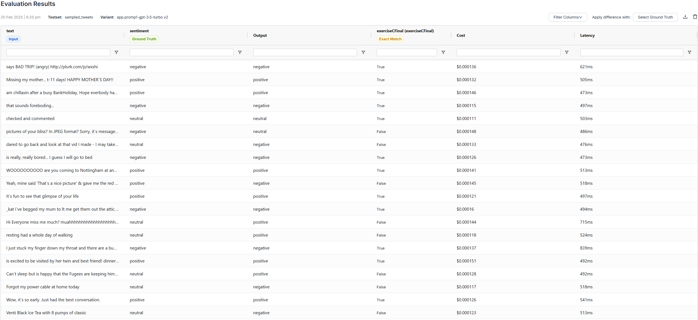
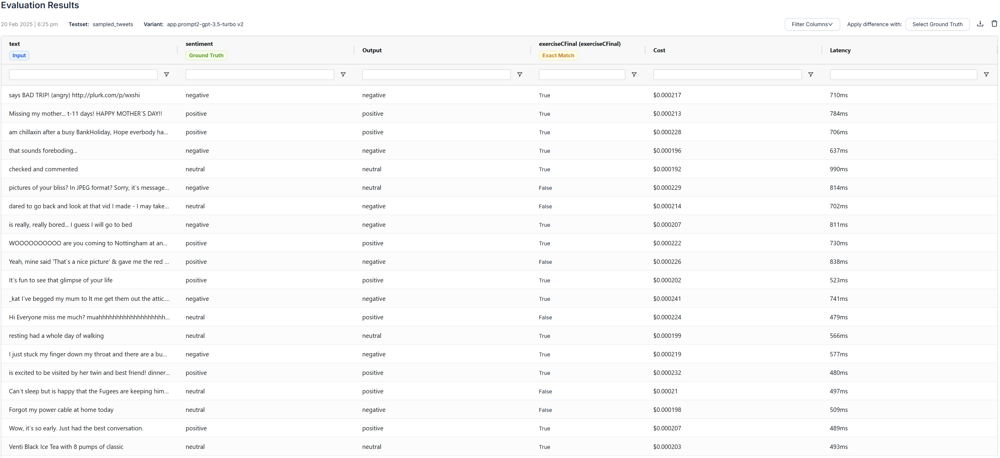
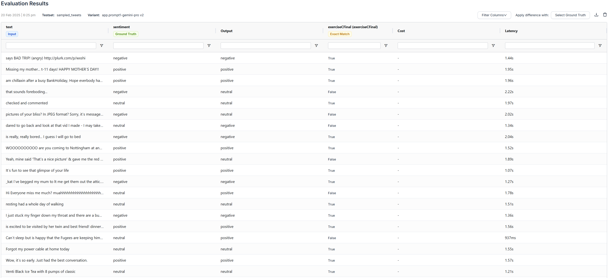
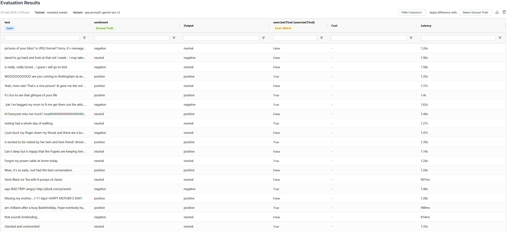
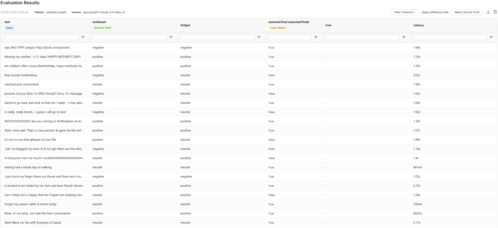
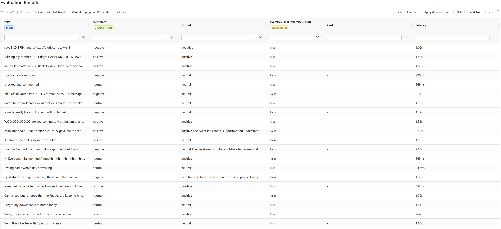
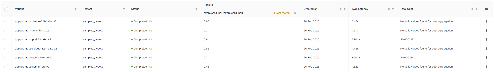
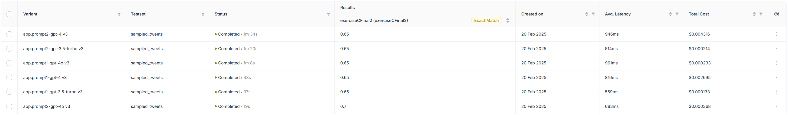

# Intro

This documents my attempts to benchmark a pair of prompts on several models.

# Step one: two best prompts

Before determining my 2 best prompts, I generated 5 prompts using ChatGPT 4o.

## Generating 5 Prompts

I determine my 5 initial prompts by asking ChatGPT 4o to generate 5 prompts. I specified what the prompts will be used for (as system prompt) and what the end goal is (to determine sentiment).

### Prompt to generate 5 prompts

I want to use various models to determine the sentiment of a tweet. The ground truth values can be either "positive", "negative", or "neutral".

Can you generate 5 prompts, that I can use as system prompts for various LLMs, such that the LLM can determine the sentiment of the tweet?

After using the prompts you generate as a system prompt, I will pass a tweet to the model, and the model should return "positive", "negative", or "neutral".

### Generated 5 prompts

Here are five different system prompts for sentiment classification of tweets using LLMs:

---

### **Prompt 1: Concise and Direct**
> You are a sentiment analysis model. Given a tweet, classify its sentiment as one of the following:  
> - **positive**  
> - **negative**  
> - **neutral**  
> Return only one of these three words as your response, without any explanations.

---

### **Prompt 2: Emotion-Focused Approach**
> Your task is to analyze the sentiment of a given tweet. Determine if the overall emotion conveyed is **positive, negative, or neutral**.  
> - If the tweet expresses happiness, excitement, or approval, return **positive**.  
> - If the tweet expresses anger, frustration, or disapproval, return **negative**.  
> - If the tweet is factual, ambiguous, or lacks strong emotion, return **neutral**.  
> Your response should be only one of these words: **positive, negative, or neutral**.

---

### **Prompt 3: Context-Aware Classification**
> Act as a sentiment classification model for tweets. Your goal is to analyze a given tweet and classify its sentiment. Follow these guidelines:  
> - Consider the tone, wording, and context of the tweet.  
> - If the tweet expresses enthusiasm, support, or positivity, return **positive**.  
> - If it expresses complaints, dissatisfaction, or negativity, return **negative**.  
> - If it is neutral, informative, or lacks sentiment, return **neutral**.  
> Your response must be one of the three words: **positive, negative, or neutral**. Do not provide explanations.

---

### **Prompt 4: NLP-Based Explanation (For More Advanced Models)**
> You are an advanced sentiment analysis model trained on textual data. Given a tweet, analyze its sentiment and classify it as one of three categories:  
> - **positive**: The tweet expresses a favorable or happy sentiment.  
> - **negative**: The tweet conveys criticism, frustration, or negative emotions.  
> - **neutral**: The tweet does not strongly express a positive or negative sentiment.  
> Your response should be exactly one of these words: **positive, negative, or neutral**. Do not include additional text.

---

### **Prompt 5: Social Media-Specific Interpretation**
> You are a sentiment analysis assistant trained to classify tweets based on sentiment. Consider the informal, abbreviated, and expressive nature of tweets while making your classification. Assign the tweet to one of the following sentiment categories:  
> - **positive**: If the tweet conveys enthusiasm, appreciation, or positive sentiment.  
> - **negative**: If the tweet expresses frustration, criticism, or negativity.  
> - **neutral**: If the tweet is objective, factual, or lacks strong sentiment.  
> Return only the sentiment classification as a single word: **positive, negative, or neutral**. Do not provide explanations or additional text.

---

Each of these prompts has a slightly different approach, ranging from concise classification to emotion-based interpretation. Let me know if you need modifications! 🚀

## Determining 2 best prompts

To determine the 2 best prompts, I test the 5 prompts above on 5 random entries from the `example_tweets.csv` and then I determine which prompts performed the best.

To determine the 5 random entries, I use the python code from [Step two](#step-two-select-20-tweets) to select 5 tweets.

Here are the 5 tweets:

```
textID,text,selected_text,sentiment
ac33177eec,Venti Black Ice Tea with 8 pumps of classic,Venti Black Ice Tea with 8 pumps of classic,neutral
ef42dee96c,resting had a whole day of walking,resting had a whole day of walking,neutral
7579b68067,"is excited to be visited by her twin and best friend! dinner, star gazing, and a movie!   // cool http://gykd.net","is excited to be visited by her twin and best friend! dinner, star gazing, and a movie!   // cool",positive
4dad557268,says BAD TRIP! (angry)  http://plurk.com/p/wxshi,says BAD TRIP!,negative
a7f72a928a, WOOOOOOOOOO   are you coming to Nottingham at any point?  lovelovelove<3,t?  lovelovelove,positive
```

To determine which prompt was the best, I asked `gpt-3.5-turbo` to determine the sentiment for each of the tweets above for each of the system prompts by using [Agenta.ai](Agenta.ai). Here are the results I got:

| Prompt | ac33177eec | ef42dee96c | 7579b68067 | 4dad557268 | a7f72a928a |
|--------|------------|------------|------------|------------|------------|
| 1 | neutral | neutral | positive | negative | positive |
| 2 | neutral | neutral | positive | negative | positive |
| 3 | neutral | positive | positive | negative | positive |
| 4 | neutral | positive | positive | negative | positive |
| 5 | neutral | positive | positive | negative | positive |

From the results, prompts 3, 4, and 5, returned "positive" for the tweet with textID = ef42dee96c, but the correct sentiment was "neutral". I hypothesize that this is because prompts 4 and 5 specific positive as "favorable" and "appreciation" respectively, and the model could have determined "resting" as "favorable" or "appreciation".

[Prompt 1](#prompt-1-concise-and-direct) and [Prompt 2](#prompt-2-emotion-focused-approach) were able to get all sentiments correct; thus, I will utilize those prompts for the final benchmark.

# Step two: select 20 tweets

## Prompt - Generating Python Script using ChatGPT 4o


I have a `example_tweets.csv` file that has the these columns: `textID`, `text`, `selected_test`, and `sentiment`. It has many rows, and I only want to sample 20 rows. I want the 20 rows to be representative, so approximately a third of the rows should have "positive" sentiment, approximately a third of the rows should have "negative" sentiment, and approximately a third of the rows should have "neutral" sentiment. Can you write me a Python script that accomplishes the task of sampling 20 rows from the dataset?

## Result - Generated Python Script

Here’s a Python script that loads the `example_tweets.csv` file, samples 20 rows while maintaining approximately equal representation of each sentiment class, and saves the sampled dataset to a new CSV file.

```{python}
import pandas as pd

def sample_tweets(file_path, sample_size=20):
    # Load the dataset
    df = pd.read_csv(file_path)
    
    # Ensure sentiment column exists
    if 'sentiment' not in df.columns:
        raise ValueError("The dataset must contain a 'sentiment' column.")
    
    # Define the number of samples per sentiment class
    num_samples_per_class = sample_size // 3
    remainder = sample_size % 3
    
    # Sample approximately equal number of rows from each sentiment category
    sampled_df = (df.groupby('sentiment', group_keys=False)
                    .apply(lambda x: x.sample(n=min(len(x), num_samples_per_class), random_state=42)))
    
    # If there is a remainder, sample additional rows from random sentiment groups
    if remainder > 0:
        additional_samples = df.sample(n=remainder, random_state=42)
        sampled_df = pd.concat([sampled_df, additional_samples])
    
    # Shuffle the final sampled dataset
    sampled_df = sampled_df.sample(frac=1, random_state=42).reset_index(drop=True)
    
    return sampled_df

# Usage example
file_path = "example_tweets.csv"  # Adjust path if needed
sampled_tweets = sample_tweets(file_path)

# Save to a new CSV file
sampled_tweets.to_csv("sampled_tweets.csv", index=False)
```

This script ensures that the sampled dataset has an approximately equal distribution of sentiment categories while handling cases where there might not be enough rows in a particular category. Let me know if you need any modifications!

## 20 Sampled Tweets

The script above sampled these 20 tweets:

```{csv}
textID	text	selected_text	sentiment
4dad557268	says BAD TRIP! (angry)  http://plurk.com/p/wxshi	says BAD TRIP!	negative
f69a80cc7e	Missing my mother... t-11 days! HAPPY MOTHER`S DAY!!	HAPPY MOTHER`S DAY!!	positive
f93c297e3a	am chillaxin after a busy BankHoliday, Hope everbody had a gd wkend! Holiday in 12 days!!!  ****	am chillaxin after a busy BankHoliday, Hope everbody had a gd wkend! Holiday in 12 days!!	positive
24489dcb26	 that sounds foreboding...	that sounds foreboding...	negative
16729cf827	 checked and commented	checked and commented	neutral
bb2ef8a121	 pictures of your bliss?  In JPEG format?  Sorry, it`s message board terminology and u don`t play w/us on the boards	pictures of your bliss?  In JPEG format?  Sorry, it`s message board terminology and u don`t play w/us on the board	negative
073a1cef9b	dared to go back and look at that vid I made - I may take it down	dared to go back and look at that vid I made - I may take it down	neutral
b34b83c44e	is really, really bored... I guess I will go to bed	is really, really bored...	negative
a7f72a928a	 WOOOOOOOOOO   are you coming to Nottingham at any point?  lovelovelove<3	t?  lovelovelove	positive
1b79929075	 Yeah, mine said 'That`s a nice picture' & gave me the red x!  Hope you get it working soon!	'That`s a nice picture'	positive
39854df96d	 It`s fun to see that glimpse of your life	s fun	positive
67beae3c7f	 _kat I`ve begged my mum to lt me get them out the attic.. but she wont let me  Waaa... and yes, was spoilt! hehe!	s spoilt	negative
b18e3e1aa1	Hi Everyone miss me much?  muahhhhhhhhhhhhhhhhhhhhhhhhhhhhhhhh ;)	Hi Everyone miss me much?  muahhhhhhhhhhhhhhhhhhhhhhhhhhhhhhhh ;)	neutral
ef42dee96c	resting had a whole day of walking	resting had a whole day of walking	neutral
9191e574bb	I just stuck my finger down my throat and there are a bunch of bumps on my tongue & throat.	stuck	negative
7579b68067	is excited to be visited by her twin and best friend! dinner, star gazing, and a movie!   // cool http://gykd.net	is excited to be visited by her twin and best friend! dinner, star gazing, and a movie!   // cool	positive
a260fd32ce	Can`t sleep but is happy that the Fugees are keeping him company	Can`t sleep but is happy that the Fugees are keeping him company	neutral
f4a743a972	Forgot my power cable at home today	Forgot my power cable at home today	neutral
e6f129e747	Wow, it`s so early. Just had the best conversation.	best	positive
ac33177eec	Venti Black Ice Tea with 8 pumps of classic	Venti Black Ice Tea with 8 pumps of classic	neutral
```


# Step three: benchmark

The 3 models I chose for the benchmark are `gpt-3.5-turbo`, `openrouter/google/gemini-pro`, and `openrouter/anthropic/claude-3.5-haiku`. The main reason I chose these 3 models is because according to [this](https://arxiv.org/abs/2312.11444) paper, Gemini Pro achieves "close but slightly inferior" results compared to GPT-3.5 Turbo. Additionally, according to [this](https://context.ai/compare/claude-3-haiku/gpt-3-5-turbo), GPT-3.5 Turbo and Claude 3 Haiku perform have relatively similar performance for the `MMLU` and `HellaSwag` metrics (other metrics were not available for comparison). Claude 3.5 Haiku is a slightly better version than Claude 3 Haiku, so I chose Claude 3.5 Haiku. Thus, I chose these 3 models since none have a "clear" advantage, and hopefully will provide interesting results.

For all 3 of the aforementioned models, I test their ability to determine the sentiment of the [20 sampled tweets](#sampled-tweets), for each of the [2 selected prompts](#determining-2-best-prompts). I will utilize `Agenta.ai` to perform this analysis and benchmarking.


# Step four: results

## Baseline

### Baseline Choice

I chose [Text2data](https://text2data.com/Demo) as my baseline and the as the established sentiment analysis tool. This website has a dedicated sentiment analysis tool for "Twitter-like content". It returns a score from -1.00 to +1.00 where "negative" is -1.00 to -0.25, "neutral" is -0.25 to +0.25, and "positive" is +0.25 to +1.00. I manually run the [20 sampled tweets](#sampled-tweets) on the sentiment analysis tool in Text2data.

### Baseline Results

Here are the Text2data results:


| textID | Ground Truth Sentiment | Predicted Sentiment | Score (-1 to 1) |
|--------|------------------------|---------------------|-----------------|
| 4dad557268 | negative | negative | -0.86 |
| f69a80cc7e | positive | negative | -0.79 |
| f93c297e3a | positive | positive | +0.99 |
| 24489dcb26 | negative | negative | -0.69 |
| 16729cf827 | neutral | neutral | +0.13 |
| bb2ef8a121 | negative | negative | -0.85 |
| 073a1cef9b | neutral | negative | -0.76 |
| b34b83c44e | negative | negative | -0.91 |
| a7f72a928a | positive | positive | +0.98 |
| 1b79929075 | positive | positive | +0.94 |
| 39854df96d | positive | positive | +0.75 |
| 67beae3c7f | negative | negative | -0.93 |
| b18e3e1aa1 | neutral | positive | +0.91 |
| ef42dee96c | neutral | neutral | +0.19 | 
| 9191e574bb | negative | negative | -1.00 |
| 7579b68067 | positive | positive | +1.00 |
| a260fd32ce | neutral | positive | +0.97 |
| f4a743a972 | neutral | negative | -0.91 |
| e6f129e747 | positive | positive | +0.78 |
| ac33177eec | neutral | positive | +0.71 |

Text2data provides a score from -1.00 to 1.00. Negative is -1.00 to -0.25. Neutral is -0.25 to +0.25. Positive is +0.25 to +1.00.

The results above show an accuracy of 70%.


## Detailed Results from Benchmark

The following images show detailed results from performing the benchmark on `Agenta.ai`.

### Prompt 1: GPT-3.5 Turbo



### Prompt 2: GPT-3.5 Turbo



### Prompt 1: Gemini Pro



### Prompt 2: Gemini Pro



### Prompt 1: Claude 3.5 Haiku



### Prompt 2: Claude 3.5 Haiku



## Summarized Results

The following image shows the summarized results:


Here are the summarized results in a easy-to-read format:

| Model | Prompt | Accuracy | Average Latency | Total Cost |
|-------|--------|----------|-----------------|------------|
| GPT-3.5 Turbo | 1 | 60% | 534ms | $0.000133 |
| Gemini Pro | 1 | 70% | 1.61s | - |
| Claude 3.5 Haiku | 1 | 65% | 1.46s | - |
| GPT-3.5 Turbo | 2 | 70% | 654ms | $0.000214 |
| Gemini Pro | 2 | 45% | 	1.32s |  - |
| Claude 3.5 Haiku | 2 | 55% | 1.46s | - |

Looking at the results, the best performing model was Gemini Pro with Prompt 1 and GPT-3.5 Turbo with Prompt 2, with both having a 70% accuracy. However, GPT-3.5 Turbo had lower average latency than Gemini Pro. Claude 3.5 Haiku performed decently well with prompt 1 with an accuracy of 65%; but not so well with prompt 2 with an accuracy of 55%.

Additionally, GPT-3.5 Turbo had the least average latency, with 534ms and 654ms for Prompt 1 and Prompt 2 respectively. On the other hand, Gemini Pro and Claude 3.5 Haiku had average latencies within the range 1.32s and 1.61s. This makes sense since the GPT-3.5 Turbo is designed to be fast.

Overall best model and prompt combination: From the results, I would chose Prompt 2 with GPT-3.5 Turbo, as it had the best accuracy (70%) and second best latency (654ms). 

However, it is important to note that Prompt 1 had better accuracy on average (60%, 65%, and 70%) across all models than Prompt 2 (45%, 55%, and 70%). Thus, if I had to select the prompt independent of the model, I would select Prompt 1.

Additionally, GPT-3.5 Turbo had better accuracy on average (60% and 70%) across both prompts compared to Gemini Pro (45% and 70%) and Claude 3.5 Haiku (55% and 65%). Thus, if I had to select the model independent of the prompt, I would select GPT-3.5 Turbo

Unfortunately, `Agenta.ai` was unable to collect the "Total Cost" for Gemini Pro and Claude 3.5 Haiku.

\textbf{Comparison with baseline:} Baseline (Text2data) had a performance of 70%. The best model/prompt combinations in this benchmark (Gemini Pro with Prompt 1 and GPT-3.5 Turbo with Prompt 2) also had a 70% accuracy. This is a good sign, as it shows that with prompt engineering, General Purpose LLMs can achieve similar accuracy as established baselines designed for sentiment analysis.

# Step five: additional benchmark

I perform an additional benchmark with the following models: GPT-3.5 Turbo, GPT-4, and GPT-4o.

I was unable to get "Total Cost" information for Gemini Pro and Claude 3.5 Haiku. To get that information, I decided to run the benchmark again using the following models: GPT-3.5 Turbo, GPT-4, and GPT-4o. I use the same prompts and the same sampled tweets from the previous benchmark. I run this benchmark on `Agenta.ai`, same as before.

## Summarized Results

The following image shows the summarized results:


Here are the summarized results in a easy-to-read format:

| Model | Prompt | Accuracy | Average Latency | Total Cost |
|-------|--------|----------|-----------------|------------|
| GPT-3.5 Turbo | 1 | 65% | 559ms | $0.000133 |
| GPT-4 | 1 | 65% | 816ms | $0.002695 |
| GPT-4o | 1 | 65% | 961ms | $0.000233 |
| GPT-3.5 Turbo | 2 | 65% | 514ms | $0.000214 |
| GPT-4 | 2 | 65% | 946ms | $0.004316 |
| GPT-4o | 2 | 70% | 683ms | $0.000368 |

Based on the results, the best-performing model was GPT-4o with Prompt 2, achieving an accuracy of 70%. The other combinations also performed relatively well, each reaching 65% accuracy, and misclassifying just one more tweet compared to the top-performing model and prompt combination.

However, it is evident that the fastest model was GPT-3.5 Turbo, with average latencies of 559ms and 514ms for Prompt 1 and Prompt 2 respectively. There is no clear evidence as to which is faster between GPT-4 and GPT-4o. For Prompt 1, GPT-4 (average latency - 946ms) is slightly faster than GPT-4o (average latency - 961ms), but for prompt 2, GPT-4o (average latency - 683ms) is faster than GPT-4 (average latency - 946ms).

On the other hand, it is evident that GPT-4 has the highest total costs, and GPT-3.5 Turbo has the least total costs. However, the total costs of GPT-4o were relatively comparable to that of GPT-3.5 Turbo, especially for Prompt 2 where GPT-4o had a total cost of \$0.000233 and GPT-3.5 Turbo had a total cost of \$0.000214.

Even though GPT-4o with Prompt 2 performs the best, I would select GPT-3.5 Turbo (with either Prompt 1 and Prompt 2 -- they had same accuracy) because the average latency and total cost is significantly less, while the accuracy only drops 5%.

\textbf{Comparison with baseline:} Baseline (Text2data) had a performance of 70%. The best model/prompt combination in this benchmark (GPT-4o with Prompt 2) also had a 70% accuracy. Additionally, other model/prompt combinations were not too far behind, with an accuracy of 65%. This is a good sign, as it shows that with prompt engineering, General Purpose LLMs can achieve similar accuracy as established baselines designed for sentiment analysis.

# Conclusion

Firstly, I select my 2 best prompts. I do this by first asking ChatGPT 4o to generate me 5 prompts that I can start with. Then I narrow down my 2 best prompts by testing all 5 prompts on 5 randomly sampled Tweets using ChatGPT-3.5 Turbo. Using this method, I was able to determine that [Prompt 1](#prompt-1-concise-and-direct) and [Prompt 2](#prompt-2-emotion-focused-approach) were the best prompts out of the 5 as they resulted in a higher accuracy in sentiment classification for the 5 Tweets.

Once I selected my 2 best prompts, I run the full benchmark using those 2 prompts on 20 tweets across 3 different LLMs. This approach allows me to complete an initial layer of filtering (narrowing from 5 to 2 prompts) with minimal resource usage -- after which I run detailed benchmarking on the 2 resulting prompts. By avoiding the need to test all 5 initial prompts in the final benchmark, this method ensures efficient use of resources.

To run the benchmark against 20 tweets, I need to first [sample 20 tweets](#step-two-select-20-tweets). I do so my asking ChatGPT 4o to write me a python script that samples 20 random tweets from `example_tweets.csv`. I also tell it to ensure that approximately a third of the tweets have a positive sentiment, approximately a third have neutral sentiment, and approximately a third have negative sentiment. This even distribution of sentiment allows me to fairly compare various prompts and models.

For the [baseline](#baseline), I use [Text2data](https://text2data.com/Demo), which provides a sentiment analysis tool for "Twitter-like content". The baseline was able to get an average accuracy of 70% on the 20 tweets.

For the [(initial) benchmark](#step-three-benchmark), I select my models of choice to be `gpt-3.5-turbo`, `openrouter/google/gemini-pro`, and `openrouter/anthropic/claude-3.5-haiku`. According to [this](https://arxiv.org/abs/2312.11444) paper, Gemini Pro achieves similar results compared to GPT-3.5 Turbo, and according to [this](https://context.ai/compare/claude-3-haiku/gpt-3-5-turbo), GPT-3.5 Turbo and Claude 3 Haiku have similar performance. Claude 3.5 Haiku is a slightly better version than Claude 3 Haiku, so I chose Claude 3.5 Haiku.

Once I had my models selected, I ran the 20 tweets for each of the model/prompt pairs. I have explained the results in detail in the [Step four](#step-four-results) section. The key finding was that the best model/prompt combinations were Gemini Pro with Prompt 1 and GPT-3.5 Turbo with Prompt 2, with both having a 70% accuracy. This accuracy also matched the accuracy of the baseline (Text2data). Across both prompts, ChatGPT-3.5 Turbo had the best accuracy. Across all 3 models, Prompt 1 resulted in the best accuracy. Finally, GPT-3.5 Turbo had the least latency, which makes sense as it is designed to run faster. Cost data was not available for Gemini Pro and Claude 3.5 Haiku.

I wanted to analyze costs across various LLMs, so I ran another benchmark using models from the OpenAI family. Specifically, I chose ChatGPT-3.5 Turbo, ChatGPT 4, and ChatGPT 4o. The detailed results are in the [Step five](#step-five-additional-benchmark) section. The key finding was that the best model/prompt combination was ChatGPT-4o with Prompt 2, achieving an accuracy of 70%. This accuracy also matched the accuracy of the baseline (Text2data). For every other combination, the accuracy was 65%, so not far behind. Additionally, ChatGPT-3.5 Turbo had the least cost. ChatGPT-3.5 Turbo also had the least latency. Even though GPT-4o with Prompt 2 performs the best, I would select GPT-3.5 Turbo (with either Prompt 1 and Prompt 2 – they had same accuracy) because the average latency and total cost is significantly less, while the accuracy only drops 5%.

Finally, it is really interesting to note that in both benchmarks, there was at least 1 model/prompt combination that had the same accuracy (70%) as Text2data, which is an established sentiment analysis tool. These results are encouraging, as they highlight the power of prompt engineering to enable general-purpose LLMs to achieve the same results as specilized tools.

